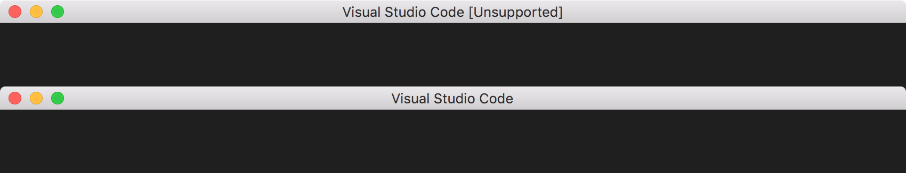

> **Warning**: This extension is now deprecated, you should use [Fix VSCode Checksums](https://marketplace.visualstudio.com/items?itemName=lehni.vscode-fix-checksums) instead, which solves the problem in a better way.

# No Unsupported

<p align="center">
	
</p>

An extension for removing "[Unsupported]" from the titlebar.

If you're using this under **Windows**, Visual Studio Code must be running as an administrator.

## Install

Follow the instructions in the [Marketplace](https://marketplace.visualstudio.com/items?itemName=fabiospampinato.vscode-no-unsupported), or run the following in the command palette:

```shell
ext install fabiospampinato.vscode-no-unsupported
```

## Usage

It adds 2 new commands to the command palette:

```js
Unsupported: Remove // Remove [Unsupported] from the titlebar
Unsupported: Restore // Restore it
```

## Before/After



## License

MIT © Fabio Spampinato
